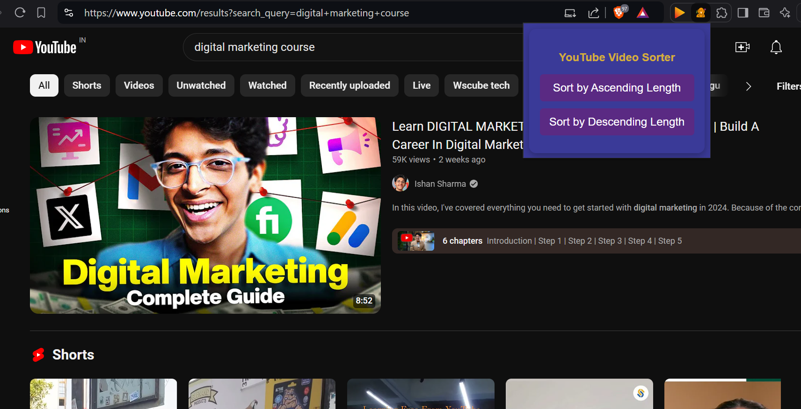

# 🎬 YouTube Video Sorter - Chrome Extension


**YouTube Video Sorter** is a lightweight and elegant Chrome extension that allows you to sort YouTube videos by their length (duration). You can easily sort videos in ascending or descending order, either from a specific channel or from a search result page. This extension enhances your YouTube browsing experience by giving you control over the video listing.

## ✨ Features

- 🕒 **Sort videos by duration** (ascending or descending order).
- 🧑‍💻 **Works on YouTube channels and search result pages**.
- 🎨 **Beautiful, clean user interface** with royal colors.
- ⚡ **Quick and efficient sorting** of all visible videos.
- 🔧 **Simple to use** with intuitive buttons for sorting.

## 🚀 Installation

To install this extension in Chrome, follow the steps below:

1. **Clone or download the repository**:
    ```bash
    git clone https://github.com/Anurag-099/yt-sort.git
    ```

2. **Open Chrome and go to the Extensions page**:
    - Type `chrome://extensions/` in the address bar.
  
3. **Enable Developer Mode**:
    - In the top right corner, toggle the **Developer mode** switch.

4. **Load the extension**:
    - Click the **Load unpacked** button and select the folder where the extension files are located (the cloned or downloaded folder).

5. **Start using the extension**:
    - The **YouTube Video Sorter** icon will appear in your extensions bar. Navigate to YouTube, click the extension icon, and choose to sort videos in ascending or descending order.

## 🎥 How to Use

1. **Open YouTube**:
    - Go to a channel or search result page with multiple videos listed.
  
2. **Click the Extension Icon**:
    - Find the **YouTube Video Sorter** icon in the top-right corner of your browser (next to the address bar).

3. **Select Sorting Order**:
    - In the popup, choose whether you want to sort videos in **ascending** or **descending** order by duration.

4. **Enjoy the Sorted Videos**:
    - The videos will now be rearranged based on their length. 🎉

## 🖼️ Screenshots

### 1. Popup UI:


### 2. Sorted YouTube Videos:


## 🛠️ Technologies Used

- **Manifest Version**: Chrome Extension Manifest V3
- **Languages**: HTML, CSS, JavaScript
- **Browser API**: Chrome Extension API
- **UI Styling**: Royal color theme

## 🔮 Future Enhancements

- Add an option to sort videos by **view count** or **upload date**.
- Support sorting on YouTube's **"Home" page**.
- Add a **dark mode** for the popup.

## ⭐ Show Your Support

If you found this project useful, please give it a ⭐ on [GitHub](https://github.com/Anurag-099/yt-sort)! Your support is greatly appreciated.

---

**Developed with ❤️ by [Anurag](https://github.com/Anurag-099)**

---

### 🌐 Social Links
- [LinkedIn](https://www.linkedin.com/in/anurag100/)
- [X (Twitter)](https://x.com/anurag_singh100)
